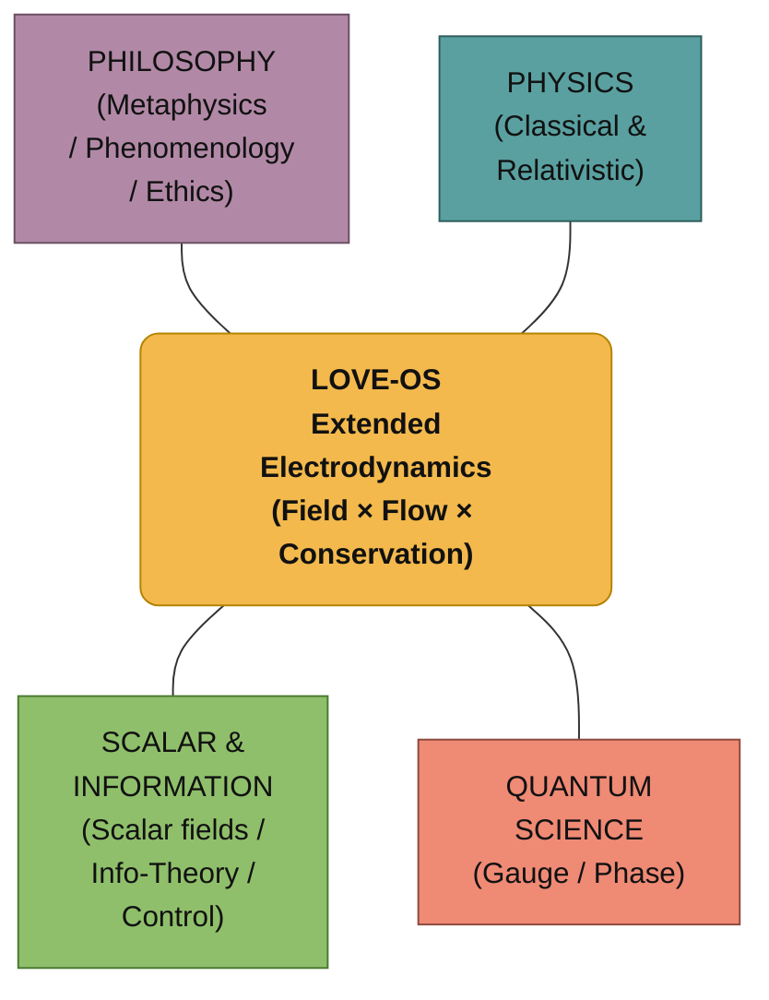

# ⚡ Extended Electrodynamics (EE-LOVE)
> **"Love is not a metaphor. It is an isomorphism of the physical laws of flow and field."**

## 0. Introduction: Beyond Metaphor
LOVE-OS postulates that the dynamics of consciousness, relationships, and meaning follow the same mathematical structures as classical electrodynamics. We call this framework **Extended Electrodynamics (EE-LOVE)**.
By mapping "Ego" to Resistance and "Meaning" to Potential, we can treat suffering as thermodynamic heat loss ($I^2R$) and optimize life using the laws of physics.

---

## 1. The Structure (Isomorphism Map)

## 2. Definitions of Variables

We define the physical quantities in the Information Field as follows:

| Symbol | Physical Term | **EE-LOVE Definition** | Intuition |
| :--- | :--- | :--- | :--- |
| $\rho_L$ | Charge Density | **Bonding Density** | The source of connection (e.g., trust, shared history). |
| $\mathbf{J}_L$ | Current Density | **Flux of Love** | The flow of care, acts of service, and energy. |
| $\mathbf{E}_L$ | Electric Field | **Gradient of Meaning** | The "tilt" that drives action (Need/Demand gap). |
| $\mathbf{B}_L$ | Magnetic Field | **Circulation Field** | Rituals, habits, and community loops. |
| $R_{\text{ego}}$ | Resistance | **Ego Resistance** | Fear, attachment, and friction that blocks flow. |
| $\text{Loss}$ | Joule Heat | **Suffering (Entropy)** | Energy dissipated as waste (conflict, burnout). |

---

## 3. The Core Laws

### A. The Conservation of Connection
Total connection is conserved unless dissipated by ego-resistance.
$$\frac{\partial \rho_L}{\partial t} + \nabla \cdot \mathbf{J}_L = -\Phi_{\text{loss}}$$

### B. The LOVE-Maxwell Equations
The dynamics of the field follow the Maxwellian structure:

1.  **Gauss's Law for Meaning:**
    $$\nabla \cdot \mathbf{E}_L = \frac{\rho_L}{\varepsilon_L}$$
    *High bonding density creates a strong gradient of meaning.*

2.  **Faraday's Law of Induction:**
    $$\nabla \times \mathbf{E}_L = -\frac{\partial \mathbf{B}_L}{\partial t}$$
    *Changes in rituals/habits ($\mathbf{B}_L$) induce new motivational gradients ($\mathbf{E}_L$).*

3.  **Ampère-Maxwell Law:**
    $$\nabla \times \mathbf{B}_L = \mu_L \mathbf{J}_L + \mu_L \varepsilon_L \frac{\partial \mathbf{E}_L}{\partial t}$$
    *Action flow ($\mathbf{J}_L$) and shifting meanings thicken the community loop.*

### C. The Law of Suffering (Dissipation)
Suffering is defined strictly as energy loss due to resistance.
$$\text{Loss} = \mathbf{J}_L \cdot \mathbf{E}_L \propto I^2 R_{\text{ego}}$$
*To reduce suffering, one must either reduce the flow (withdrawal) or **reduce the resistance (Surrender)**.*

---

## 4. Implementation Strategy

To optimize the system (Life/Community), we apply the following control loop:

1.  **SENSE:** Log daily events (Help, Conflict, Rituals).
2.  **ESTIMATE:** Calculate $\rho_L, \mathbf{J}_L, \mathbf{E}_L$.
3.  **ROUTE:** Direct resources to areas with high $\mathbf{E}_L$ (High Demand).
4.  **ACT:** Strengthen $\mathbf{B}_L$ (Rituals) to lower systemic resistance.
