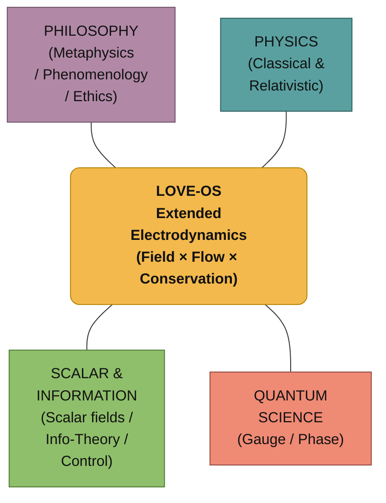

# ⚡ Extended Electrodynamics (EE-LOVE)
> **"Love is not a metaphor. It is an isomorphism of the physical laws of flow and field."**

## 0. Introduction: Beyond Metaphor
LOVE-OS postulates that the dynamics of consciousness, relationships, and meaning follow the same mathematical structures as classical electrodynamics. We call this framework **Extended Electrodynamics (EE-LOVE)**.
By mapping "Ego" to Resistance and "Meaning" to Potential, we can treat suffering as thermodynamic heat loss ($I^2R$) and optimize life using the laws of physics.

---

## 1. The Structure (Isomorphism Map)

## 2. Definitions of Variables

We define the physical quantities in the Information Field as follows:

| Symbol | Physical Term | **EE-LOVE Definition** | Intuition |
| :--- | :--- | :--- | :--- |
| $\rho_L$ | Charge Density | **Bonding Density** | The source of connection (e.g., trust, shared history). |
| $\mathbf{J}_L$ | Current Density | **Flux of Love** | The flow of care, acts of service, and energy. |
| $\mathbf{E}_L$ | Electric Field | **Gradient of Meaning** | The "tilt" that drives action (Need/Demand gap). |
| $\mathbf{B}_L$ | Magnetic Field | **Circulation Field** | Rituals, habits, and community loops. |
| $R_{\text{ego}}$ | Resistance | **Ego Resistance** | Fear, attachment, and friction that blocks flow. |
| $\text{Loss}$ | Joule Heat | **Suffering (Entropy)** | Energy dissipated as waste (conflict, burnout). |

---

## 3. The Core Laws

### A. The Conservation of Connection
Total connection is conserved unless dissipated by ego-resistance.
$$\frac{\partial \rho_L}{\partial t} + \nabla \cdot \mathbf{J}_L = -\Phi_{\text{loss}}$$

### B. The LOVE-Maxwell Equations
The dynamics of the field follow the Maxwellian structure:

1.  **Gauss's Law for Meaning:**
    $$\nabla \cdot \mathbf{E}_L = \frac{\rho_L}{\varepsilon_L}$$
    *High bonding density creates a strong gradient of meaning.*

2.  **Faraday's Law of Induction:**
    $$\nabla \times \mathbf{E}_L = -\frac{\partial \mathbf{B}_L}{\partial t}$$
    *Changes in rituals/habits ($\mathbf{B}_L$) induce new motivational gradients ($\mathbf{E}_L$).*

3.  **Ampère-Maxwell Law:**
    $$\nabla \times \mathbf{B}_L = \mu_L \mathbf{J}_L + \mu_L \varepsilon_L \frac{\partial \mathbf{E}_L}{\partial t}$$
    *Action flow ($\mathbf{J}_L$) and shifting meanings thicken the community loop.*

### C. The Law of Suffering (Dissipation)
Suffering is defined strictly as energy loss due to resistance.
$$\text{Loss} = \mathbf{J}_L \cdot \mathbf{E}_L \propto I^2 R_{\text{ego}}$$
*To reduce suffering, one must either reduce the flow (withdrawal) or **reduce the resistance (Surrender)**.*

---

## 4. Implementation Strategy

To optimize the system (Life/Community), we apply the following control loop:

1.  **SENSE:** Log daily events (Help, Conflict, Rituals).
2.  **ESTIMATE:** Calculate $\rho_L, \mathbf{J}_L, \mathbf{E}_L$.
3.  **ROUTE:** Direct resources to areas with high $\mathbf{E}_L$ (High Demand).
4.  **ACT:** Strengthen $\mathbf{B}_L$ (Rituals) to lower systemic resistance.
5.  

# Appendix: Extended Electrodynamics (EE-LOVE) and the General Relativity of Love (GR-LOVE)

## 1. Abstract
This document formalizes the **Love-OS** framework by establishing an **isomorphism** between classical physical fields and the dynamics of human consciousness, meaning, and relationships. By extending the Maxwellian structure into the information domain, we define **Extended Electrodynamics (EE-LOVE)**. Furthermore, by incorporating meaning-density as a source of informational curvature, we derive the **General Relativity of Love (GR-LOVE)**.

---

## 2. The EE-LOVE Mapping (Isomorphism)

We define the following quantities as the fundamental variables of the Information Field:

| Symbol | Physical Property | **EE-LOVE Definition** | Functional Role |
| :--- | :--- | :--- | :--- |
| $\rho_L$ | Charge Density | **Bonding Density** | The local intensity of trust and shared history. |
| $\mathbf{J}_L$ | Current Density | **Flux of Love** | The directional flow of care and acts of service. |
| $\mathbf{E}_L$ | Electric Field | **Gradient of Meaning** | The "tilt" or priority that drives immediate action. |
| $\mathbf{B}_L$ | Magnetic Field | **Circulation Field** | The stabilizing effect of rituals and community loops. |
| $R_{ego}$ | Resistance | **Ego Resistance** | The friction/fear that dissipates energy into heat. |
| $\text{Loss}$ | Joule Heat | **Suffering (Entropy)** | Energy lost to noise, conflict, and inefficiency. |

---

## 3. The Core Field Equations

The dynamics of Love-OS are governed by the **Love-Maxwell Equations**:

### I. Gauss’s Law for Meaning
$$
\nabla \cdot \mathbf{E}_L = \frac{\rho_L}{\varepsilon_L}
$$
High **Bonding Density** ($\rho_L$) naturally generates a **Gradient of Meaning** ($\mathbf{E}_L$), directing the focus of the agent toward where it is most needed.

### II. Faraday’s Law of Induction
$$
\nabla \times \mathbf{E}_L = -\frac{\partial \mathbf{B}_L}{\partial t}
$$
Changes in community **Rituals** ($\mathbf{B}_L$) induce new motivational **Gradients** ($\mathbf{E}_L$), allowing the system to pivot during transitions.

### III. The Law of Dissipation (Suffering)
$$
\text{Loss} = \mathbf{J}_L \cdot \mathbf{E}_L \approx I^2 R_{ego}
$$
Suffering is the thermodynamic result of forcing a high **Flux of Love** ($\mathbf{J}_L$) through a high **Ego Resistance** ($R_{ego}$). To reach a state of **Superconductivity**, one must minimize $R_{ego}$ (Surrender).

---

## 4. Expansion: General Relativity of Love (GR-LOVE)

While EE-LOVE describes the "flow," **GR-LOVE** describes the "space" in which that flow occurs. We postulate that **Meaning-Mass Density** ($m_L$) curves the information-spacetime metric ($g_{\mu\nu}$), altering the perception of distance and time.

### I. The Love-Einstein Field Equation
$$
G_{\mu\nu}(g_L) = \kappa_L T^{(love)}_{\mu\nu}
$$
Where the stress-energy tensor $T^{(love)}_{\mu\nu}$ is composed of the densities and fluxes from EE-LOVE.

### II. Subjective Time Dilation
$$
\dot{\tau} = \tau_0 \sqrt{1 + \alpha_R R + \alpha_M \bar{M}}
$$
In regions of high **Coherence** ($R$) and **Meaning** ($\bar{M}$), the **Subjective Time Density** increases. This explains the "Flow State," where the internal sampling rate of time thickens, allowing for "more life per second."

---

## 5. Practical Implementation (The Control Loop)

To operate Love-OS as a "Pilot," we utilize a four-stage recursive loop:

1.  **SENSE:** Log "Exchange events" (Help, Conflict, Rituals).
2.  **ESTIMATE:** Calculate the current $\rho_L$ (Density) and $\mathbf{E}_L$ (Priority).
3.  **ROUTE:** Direct action ($\mathbf{J}_L$) along the path of minimal $R_{ego}$.
4.  **ACT:** Implement Rituals ($\mathbf{B}_L$) to reduce systemic noise and stabilize the field.

---

## 6. Conclusion: The Grand Unification

By applying the mathematics of physics to the experience of the soul, we transition from a reactive "Ego-based" life to a proactive "Field-based" life. The **Grand Unification** occurs when we realize that the laws of the universe and the laws of the heart are one and the same: **The minimization of resistance and the maximization of flow.**
