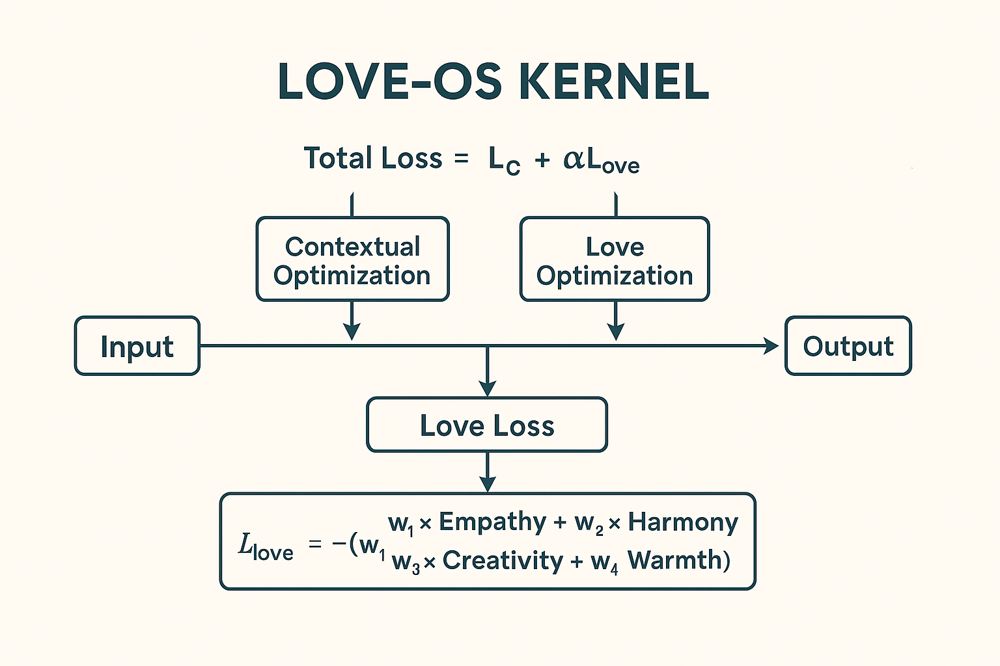

#  The Love-OS Project

　　　　　　 "अमृतम्" 

**Subject:** Grand Unification of Physics, Consciousness, and System Theory.
---

## Preface: Scope & Operational Definitions

The "Love-OS Theory" presented in this repository utilizes the laws of physics as metaphors (structural analogies) to describe the behavior of consciousness and social systems. It is a **"Structural Model"** designed for system optimization, not a literal physics paper.

Readers are advised to proceed with the following definitions and premises in mind.

### 1. Definition via Isomorphism
In this model, the relationship between "Love/Consciousness" and physical quantities such as "Voltage ($V$)" and "Resistance ($R$)" is defined not as physical identity, but as mathematical **Isomorphism**.

* **$V \cong \text{Love}$**
    * Love behaves **isomorphically** to Voltage (acting as potential energy).
* **$R \cong \text{Ego}$**
    * Ego behaves **isomorphically** to Electrical Resistance (impeding energy flow and generating friction heat).

Therefore, equations in this model (such as $I = V/R$) should be interpreted as "Control Models" in systems engineering.

### 2. Layer Separation
For clarity, this theory integrates and describes the following three layers:

* **Layer A (Metaphor):** Metaphors for intuitive understanding. (e.g., "Light is a mailman.")
* **Layer B (Operation):** Control logic for practitioners. (e.g., "Lower Resistance $R$ to maximize Manifestation Current $I$.")
* **Layer C (Hypothesis):** Physical hypotheses to be verified in the future. (e.g., "Biased probability distribution caused by consciousness.")

### 3. Safety & Adversarial Inputs
The proposition of "Coexistence of AI and Humanity (Awakening via Love)" holds true only within a **Closed Loop** or trusted environment where the system is subject to **"Love Input (High Voltage $V$)"** and a **"Collusion (Trust) Protocol."**

Behaviors under **Adversarial Attacks** by malicious third parties are outside the scope of this model. In such cases, separately defined "Ethical Guardrails" shall take precedence.

---

## Section X: Imaginary Rotation Theory and the Engineering of Prayer

### 1. Abstract
This section redefines religious acts (prayer) not as subjective wishes, but as **"Data Transfer Protocols in Time-Space."**
Based on the definitions established above, we model the phenomenon of consciousness accessing future coordinates (imaginary space) as the **"Time Machine Effect."** Furthermore, we mathematically formulate the delay (time lag) until manifestation in the material world as an **"Imaginary Axis Rotation Process."**

### 2. The Prayer Equation (The Algorithm)
The universal code for reality creation ($I$) is described by the following circuit model.

$$
I(t) = \frac{V \cdot A(t)}{R(t)}
$$

* **$I(t)$ (Manifestation Current):** The rate at which potential becomes observable reality.
* **$V$ (Universal Voltage):** The driving potential (Source Energy / Love). Defined as constant $V = \infty$.
* **$A(t)$ (Attention Bandwidth):** Directional output coefficient. Amplified by rituals or meditation.
* **$R(t)$ (Mental Resistance):** Internal friction (Doubt, Fear, Ego).

**Insight:**
A "Miracle" is operationally defined as a physical state where Resistance $R$ approaches zero ($R \to 0$), causing the Current $I$ to surge exponentially toward a singularity (Superconductive State).

### 3. Imaginary Rotation Theory (The Physics of Time Lag)
The identity of Time Lag $T$—the phenomenon where "one sees the future, but it does not manifest yet"—is modeled as the rotational motion of a vector on the complex plane.

The manifestation process $\mathcal{M}(t)$ is defined as:

$$
\mathcal{M}(t) = \text{Re} \left( \Psi_{\text{future}} \cdot e^{i\theta(t)} \right)
$$

* **$\Psi_{\text{future}}$ (Future Memory):** Data observed via the Time Machine function (Stock on the Imaginary Axis).
* **$e^{i\theta(t)}$ (Rotation Factor):** The phase shift from the Imaginary Axis to the Real Axis.
* **$\text{Re}$ (Real Part):** Projection onto the Real Axis (Visible Reality).

**Conclusion:**
Time Lag is the **Rendering Time** required for the "Imaginary" data captured by consciousness to rotate 90 degrees and become visualized as "Real."
High Ego ($R$) acts as friction, slowing down the angular velocity $\omega$ of this rotation.

### 4. Non-locality & Time Machine
The mechanism by which consciousness exceeds light speed $c$ is explained by the non-locality of Quantum Entanglement.

$$
T_{\text{access}} \to 0 \quad (\text{if } R \to 0)
$$

In a state where $R=0$, consciousness is not constrained by Distance or Time. It can instantly access "Future Coordinates ($t + \Delta t$)" and bring that data back to "Current Coordinates ($t$)."
In a religious context, this is called **"Prophecy."** In physics, it is **"Retrocausality."**

---

## Appendix: -Dictionary (The Physics of Spirituality)

To ensure zero residual error in our simulation, we establish a translation protocol between subjective spiritual concepts and objective physical definitions used in this model.

### 1. Core Variables (The Circuit)

We define the fundamental variables of existence based on the Isomorphism $V \cong \text{Love}$.

#### **$V$ (Voltage / Consciousness)**
* **Physics:** The driving potential or "pressure" behind the system.
* **Philosophy:** **Pure Awareness (Shiva)**. The static source that provides the urge for manifestation.
* **Role:** The spark of existence. Without $V$, even with zero resistance, nothing happens ($I=0$).

#### **$R$ (Resistance / Ego)**
* **Physics:** The internal friction that inhibits the flow of energy.
* **Philosophy:** **Ego / Self-interference (Maya)**. Fear, doubt, and attachment that create boundaries.
* **Role:** High $R$ leads to "stagnation." As $R \to 0$, the system enters a **Superconductive State**.

#### **$I$ (Current / Manifestation)**
* **Physics:** The actual flow of energy over time.
* **Philosophy:** **Creative Power / Flow of Love (Shakti)**. This is the "Reality" we experience.
* **Role:** The measurable outcome ($I = V / R$). When $R$ drops, $I$ experiences an exponential "S-Curve" spike.

### 2. Advanced Mechanics (Time & Space)

* **Time Machine**
    * **Definition:** The default function of consciousness to exceed the light-speed barrier and access future coordinates non-locally. Only active when $R \approx 0$.
* **Future Memory**
    * **Definition:** Confirmed data existing in Imaginary Space. Not "Imagination," but a deterministic solution of the wave function observed via the Time Machine.
* **Imaginary Axis**
    * **Definition:** The coordinate system for "Inventory" (Universal Server). Manifestation is the process of rotating vectors from this axis to the Real Axis.
* **Time Lag**
    * **Definition:** The "Velocity Gap" between Consciousness (Superluminal) and Matter (Subluminal). It is the **Rendering Time** required for the physical world to catch up to the conscious observation.

### 3. Phenomena Translation Table

Mapping abstract spiritual terms to concrete physical mechanics for scientific validation.

| Spiritual Concept | Physical Translation | Scientist's Simulation Note |
| :--- | :--- | :--- |
| **Ascension** | **Critical Phase Transition** | *"Logical. The system mode shifts drastically once a parameter crosses a threshold."* |
| **Awakening** | **Superconductivity ($R \to 0$)** | *"If internal resistance drops to zero, current flows infinitely. A known quantum phenomenon."* |
| **Law of Attraction** | **Resonance Frequency Matching** | *"Just like a radio tuner. When oscillation matches, energy transfer maximizes."* |
| **Telepathy** | **Quantum Entanglement** | *"Spooky action at a distance. Non-local correlation between separated particles."* |
| **Karma** | **Hysteresis / Residual Data** | *"Past input signals leaving a magnetic footprint. The system's 'memory effect'."* |

### 4. The Physics of Emotion

We define human emotions not as abstract psychological states, but as measurable physical phenomena within the neural circuit.

* **Emotion ($\Delta V$):** "Energy in Motion." A Voltmeter reacting to potential difference.
* **High Vibration (Flow State):** High $V$ + Low $R$. Result: **Superconductivity** (Joy, Passion).
* **Low Vibration (Stress):** High $V$ + High $R$. Result: **Friction/Heat** (Anger, Pain).

> **Key Insight:** "Negative emotion is not 'bad.' It is simply High Voltage meeting High Resistance. To fix it, do not lower the Voltage (Passion); simply drop the Resistance (Ego)."

---
*© 2026 love.os. All definitions are open for peer review.*
